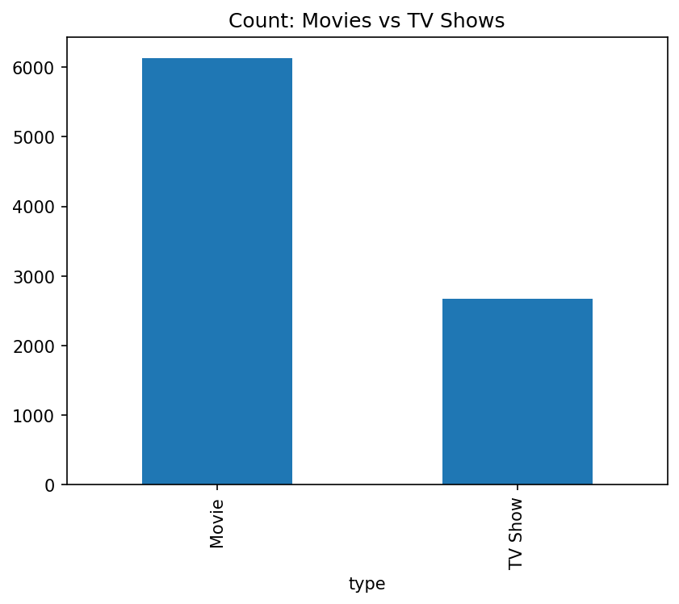
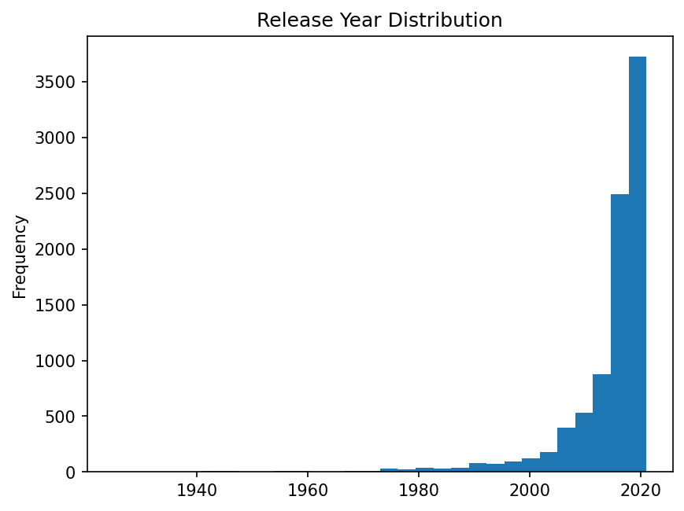

📊 Netflix Data Engineering ETL Pipeline (Day 2)
📌 Project Overview

This project is a real-world Data Engineering ETL pipeline built using a Kaggle Netflix dataset.
The goal is to demonstrate how raw, messy data can be validated, cleaned, verified, and prepared for downstream analytics or data warehouse loading.

The pipeline follows professional Data Engineering practices such as raw vs cleaned data separation, schema and quality validation, modular ETL design, and early failure on bad data.

🎯 What This Project Does

Reads raw Netflix data from a CSV file

Validates raw data for schema and basic sanity checks

Cleans fixable data quality issues (nulls, invalid years, duplicates)

Re-validates cleaned data with strict rules

Saves a clean, analytics-ready dataset

Automatically generates plots to visually verify data quality

Simulates bad data to demonstrate pipeline failure behavior

🗂 Project Structure
de-netflix-etl-quality/
│
├── data/
│   ├── raw/                 # Original Kaggle dataset (never edited)
│   └── cleaned/             # Cleaned output dataset
│
├── src/
│   ├── extract.py           # Load raw CSV data
│   ├── validation.py        # Raw & cleaned data validation
│   ├── transform.py         # Data cleaning logic
│   ├── load.py              # Save cleaned data
│   ├── visual_checks.py     # Auto-generate ETL verification plots
│   ├── simulate_bad_data.py # Create bad dataset for FAIL demo
│   └── run_etl.py           # One-command ETL runner
│
├── outputs/
│   └── plots/               # Saved data-quality plots
│
├── notebooks/               # Exploratory notebooks
├── requirements.txt
├── .gitignore
└── README.md

🛠 Technologies Used

Python
Pandas
Matplotlib
JupyterLab
Git & GitHub

▶️ How to Run the Project
1️⃣ Create and activate virtual environment
python -m venv .venv
source .venv/bin/activate

2️⃣ Install dependencies
pip install -r requirements.txt

3️⃣ Run ETL pipeline (normal run)
python src/run_etl.py

4️⃣ Run ETL with bad-data simulation (FAIL demo)
python src/simulate_bad_data.py
python src/run_etl.py data/raw/netflix_titles_BAD.csv

📈 Outputs Generated
Cleaned Dataset

data/cleaned/netflix_cleaned.csv

Auto-Generated Plots (ETL Verification)

Movies vs TV Shows count

Release year distribution

Titles added per year trend

outputs/plots/
├── type_counts.png
├── release_year_hist.png
└── titles_added_by_year.png

Sample Plot Previews
### Outputs (Saved Plots)




### Run
```bash
python -m venv .venv
source .venv/bin/activate
pip install -r requirements.txt

# Run with default raw dataset
python src/run_etl.py

# Run with a specific file (e.g., bad dataset test)
python src/run_etl.py data/raw/netflix_titles_BAD.csv
